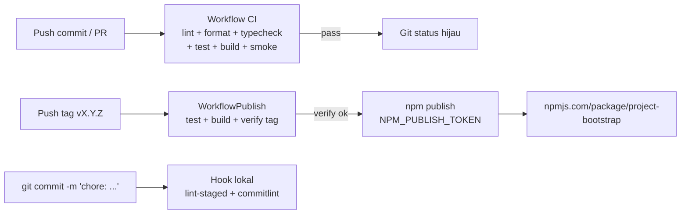

# CI/CD & Publikasi GitHub

Dokumentasi ini menjelaskan secara lengkap pipeline *Continuous Integration* (CI) dan
alur publikasi paket **project-bootstrap** ke npm yang dijalankan oleh GitHub
Actions, serta tooling *git governance* lokal yang ikut mengontrol kualitas sebelum
commit sampai ke remote.

Dua workflow GitHub Actions dikelola di `.github/workflows/`:

| File          | Workflow  | Tujuan                                                    |
| ------------- | --------- | --------------------------------------------------------- |
| `ci.yml`      | `CI`      | Validasi setiap push/PR: lint, format, typecheck, test, build, smoke-test |
| `publish.yml` | `Publish` | Rilis otomatis ke npm saat tag `v*` di-push               |

---

## 1. Workflow CI (`ci.yml`)

### 1.1 Trigger

Workflow `CI` berjalan otomatis pada:

| Event          | Detail                                    |
| -------------- | ----------------------------------------- |
| `push`         | Branch `master` dan `main`                |
| `pull_request` | Semua pull request (tidak dibatasi branch) |

Artinya, setiap kali ada commit di branch utama atau PR dibuka/diupdate,
GitHub Actions menjalankan satu job validasi penuh.

### 1.2 Job: `test` (Lint + Format + Typecheck + Test + Build)

Job dijalankan pada runner `ubuntu-latest`.

#### Langkah-langkah

1. **Checkout**
   - Action: `actions/checkout@v6`
   - Mengambil source repository pada commit yang memicu workflow.

2. **Set up Node**
   - Action: `actions/setup-node@v6`
   - Versi Node: `24`
   - Memasang toolchain Node.js untuk langkah berikutnya.

3. **Install dependencies**
   - Perintah: `npm install`
   - Menginstal seluruh dependencies berdasarkan `package-lock.json`.
   - Script `prepare` dari `package.json` juga membuat husky hooks aktif
     (tidak ada commit di CI, sehingga hook tidak terlibat).

4. **Lint**
   - Perintah: `npm run lint` → `eslint .`
   - Menjalankan ESLint (flat config `eslint.config.js`) terhadap seluruh
     source: `src/**/*.ts`, `scripts/**/*.mjs`, dan file konfigurasi `*.cjs`.
   - `dist`, `node_modules`, `src/templates`, dan `coverage` diabaikan.
   - Aturan dari `@eslint/js` + `typescript-eslint` (type-aware)
     + `eslint-config-prettier` (menonaktifkan aturan gaya agar tidak
     bertentangan dengan Prettier).

5. **Format check**
   - Perintah: `npm run format:check` → `prettier --check .`
    - Ensure semua file sudah sesuai format Prettier
      (`.prettierrc.json`: `semi`, `singleQuote`, `trailingComma: all`,
      `printWidth: 160`).
   - Tidak mengubah file; hanya melaporkan jika ada file yang belum rapi.

6. **Typecheck**
   - Perintah: `npm run typecheck` → `tsc -p tsconfig.json --noEmit`
   - Menjamin tidak ada error tipe di seluruh kode, termasuk file test
     (file `*.test.ts` tidak lagi di-exclude di `tsconfig.json`).

7. **Test**
   - Perintah: `npm test` → `vitest run`
   - Menjalankan seluruh unit test dengan Vitest.

8. **Build**
   - Perintah: `npm run build`
   - Menjalankan `tsc -p tsconfig.build.json` lalu `scripts/copy-templates.mjs`
     untuk menyalin template dari `src/templates` ke `dist/templates`.

9. **Smoke-test CLI**
   - Perintah:
     ```bash
     node dist/cli/index.js inspect .
     node dist/cli/index.js doctor .
     ```
   - Menjalankan CLI hasil build terhadap repository itu sendiri.
   - Memastikan `inspect` dan `doctor` bekerja tanpa error pada output
     nyata, bukan hanya kompilasi.

### 1.3 Hasil CI

CI **pass** hanya jika semua langkah berhasil. Jika salah satu gagal (lint,
format, typecheck, test, build, atau smoke-test), workflow ditandai `failure`
dan status terlihat pada halaman commit / PR di GitHub.

Status badge dapat ditambahkan ke README:

```md
[](https://github.com/alpinnz/project-bootstrap/actions/workflows/ci.yml)
```

---

## 2. Workflow Publish (`publish.yml`)

### 2.1 Trigger

Workflow `Publish` dipicu pada:

```yaml
on:
  push:
    tags: ['v*']
```

Artinya: setiap kali **tag dengan prefix `v`** di-ign ke remote
(`git push origin <tag>`), GitHub Actions otomatis menjalankan publikasi ke npm.

Tag yang cocok, contoh: `v0.0.1`, `v0.0.5`, `v1.2.3`.

### 2.2 Job: `publish` (Publish to NPM)

#### Langkah-langkah lengkap

1. **Checkout**
   - Action: `actions/checkout@v6`
   - Mengambil source sesuai commit yang di-tag.

2. **Set up Node**
   - Action: `actions/setup-node@v6`
   - Versi Node: `24`
   - **`registry-url: https://registry.npmjs.org`**
   - Konfigurasi ini memberitahu npm untuk memakai registry publik
     npmjs.org dan menyiapkan kredensial otomatis.

3. **Install dependencies**
   - Perintah: `npm ci`
   - Instalasi deterministik berdasarkan `package-lock.json` (lebih ketat dan
     cocok untuk environment CI).

4. **Test**
   - Perintah: `npm test`
   - Menjalankan ulang seluruh test sebelum publish sebagai gerbang keamanan.

5. **Build**
   - Perintah: `npm run build`
   - Menghasilkan `dist/` yang akan dikemas ke npm.

6. **Verify version matches tag** (menjaga konsistensi)
   - Perintah:
     ```bash
     TAG_VERSION="${{ github.ref_name }}"
     PACKAGE_VERSION=$(node -e "const p=require('./package.json'); console.log(p.version);")
     if [ "${TAG_VERSION#v}" != "$PACKAGE_VERSION" ]; then
       echo "Tag ${TAG_VERSION} does not match package.json version ${PACKAGE_VERSION}"
       exit 1
     fi
     ```
   - `github.ref_name` berisi nama tag (misal `v0.0.5`).
   - `PACKAGE_VERSION` dibaca dari `package.json`.
   - Jika versi di `package.json` **tidak sama** dengan tag tanpa prefix `v`,
     proses dihentikan dengan exit code 1.
   - Contoh sukses: tag `v0.0.5` → `package.json` harus berisi `version: "0.0.5"`.
   - Contoh gagal: tag `v0.0.6` tapi `package.json` masih `0.0.5`.

7. **Publish**
   - Perintah: `npm publish`
   - Dengan variabel environment:
     ```yaml
     env:
       NODE_AUTH_TOKEN: ${{ secrets.NPM_PUBLISH_TOKEN }}
     ```
   - Action `setup-node` membacara `NODE_AUTH_TOKEN` dari *repository secret*
     dan menulis token OAut ke `.npmrc`, sehingga `npm publish` terautentikasi
     tanpa `npm login` manual.
   - Hanya konten dalam daftar `files` (`dist`) yang diunggah ke npm.

### 2.3 Prasyarat: Secret `NPM_PUBLISH_TOKEN`

Sebelum rilis pertama, buat **npm access token** bertipe `Automation` dan
simpan sebagai *repository secret*:

1. Buka [npmjs.com](https://www.npmjs.com) → `Access Tokens` → **Generate New Token**
   → pilih tipe **Automation** (risiko rendah, khusus untuk CI) dengan scope
   `read/write publish`.
2. Salin token.
3. Di GitHub: Repository → **Settings → Secrets and variables → Actions →
   New repository secret**.
4. Beri nama `NPM_PUBLISH_TOKEN`, tempel token, lalu simpan.

> Pastikan nama secret **persis** `NPM_PUBLISH_TOKEN` karena workflow merujuk
> ke `secrets.NPM_PUBLISH_TOKEN`.

---

## 3. Tooling Git Governance Lokal

Selain CI, ada tool yang berjalan **lokal** sebelum commit, sehingga apa yang
di-push sudah lolos sebagian besar gate CI.

| Tool        | File config                          | Peran                                   |
| ----------- | ------------------------------------ | --------------------------------------- |
| ESLint      | `eslint.config.js`                   | lint source (type-aware lint)           |
| Prettier    | `.prettierrc.json`, `.prettierignore`| memformat source & docs                 |
| husky       | `.husky/`                            | menjalankan git hooks                   |
| commitlint  | `commitlint.config.cjs`              | validasi pesan commit (Conventional Commits) |
| lint-staged | `package.json` (`lint-staged`)       | menjalankan lint/format pada file staged |

### 3.1 Cara kerja husky + commitlint

- **`husky`** dipasang sebagai devDependency dan diaktifkan lewat script
  `prepare` (`"prepare": "husky"`) pada `npm install`, sehingga meng-aktifkan
  hooks di `.husky/`.
- **Hook `pre-commit`** (`npx lint-staged`): sebelum commit, lint-staged
  menjalankan:
  - `eslint --fix` + `prettier --write` pada `src/**/*.ts`;
  - `prettier --write` pada `src/**/*.{json,md}`.
  File yang diubah oleh hook tetap berada di working tree; perlu
  `git add` ulang jika berubah setelah staging.
- **Hook `commit-msg`** (`npx --no -- commitlint --edit "$1"`): memvalidasi
  pesan commit mengikuti aturan [Conventional
  Commits](https://www.conventionalcommits.org). Aturan yang diizinkan pada
  `commitlint.config.cjs`:

  ```js
  type-enum: [
    2,
    'always',
    [
      'feat', 'fix', 'docs', 'style', 'refactor', 'perf',
      'test', 'chore', 'build', 'ci', 'release',
    ],
  ]
  ```

  Tipe `release` diizinkan untuk pesan rilis gaya `Release X.Y.Z`.

### 3.2 Implikasi untuk pengembangan

- Setiap commit harus berformat `<type>: <subject>`, contoh:
  - `feat: add detect command`
  - `fix: correct doctor path resolution`
  - `chore: bump version to 0.0.6`
  - `ci: add npm test step to publish workflow`
- Commit yang tidak sesuai akan **ditolak** oleh hook `commit-msg` sebelum
  commit dibuat.

---

## 4. Alur Release Lengkap (step-by-step)

Proses rilis digaris bawahi sebagai berikut:

1. **Naikkan versi** di `package.json` sesuai semver (patch/minor/major),
   contoh `0.0.5` → `0.0.6`.

2. **Commit dan push ke branch utama** — pesan commit wajib mengikuti
   Conventional Commits (hook `commit-msg`). Contoh:
   ```bash
   git add package.json package-lock.json
   git commit -m "chore: bump version to 0.0.6"
   git push origin master
   ```
   > Hook `pre-commit` (lint-staged) dan `commit-msg` (commitlint) berjalan
   > sebelum commit selesai; jika gagal, commit tidak dibuat.
   > Push ke branch utama memicu workflow `CI` untuk validasi penuh.

3. **Buat tag rilis** — pastikan versi di tag sesuai `package.json`:
   ```bash
   git tag v0.0.6
   git push origin v0.0.6
   ```
   Push tag akan memicu workflow `Publish`.

4. **Tunggu workflow `Publish` selesai**
   - Buka tab **Actions** di GitHub → workflow `Publish` → lihat run terbaru.
   - Pastikan langkah **Verify version matches tag** berwarna hijau.

5. **Verifikasi di npm**
   - Buka `https://www.npmjs.com/package/project-bootstrap`.
   - Pastikan versi baru muncul di daftar versi.

### Checklist singkat sebelum menpilkan

| Kondisi                                             | Konsekuensi jika gagal            |
| --------------------------------------------------- | --------------------------------- |
| `package.json` version = tag (tanpa `v`)            | Publish ditolak di guard          |
| Commit message sesuai commitlint                    | Commit ditolak oleh hook          |
| Lint + format + typecheck + test lulus              | Workflow gagal sebelum publish    |
| Secret `NPM_PUBLISH_TOKEN` tersedia                 | `npm publish` gagal autentikasi   |
| Versi belum pernah dipublikasikan sebelumnya        | `npm publish` error `403` conflict |

---

## 5. Perbedaan `ci.yml` vs `publish.yml`

| Aspek            | `ci.yml`                                              | `publish.yml`                          |
| ---------------- | ----------------------------------------------------- | -------------------------------------- |
| Trigger          | push `master`/`main`, semua PR                        | push tag `v*`                          |
| Tujuan           | validasi kualitas                                     | publikasi release ke npm               |
| Setup runner     | Node 24                                               | Node 24 + `registry-url` npmjs.org     |
| Instalasi        | `npm install`                                         | `npm ci`                               |
| Urutan langkah   | lint → format → typecheck → test → build → smoke-test | test → build → verify tag → publish    |
| Re-run per PR    | disarankan                                            | tidak relevan (langsung rilis)         |
| Butuh secret     | tidak                                                 | `NPM_PUBLISH_TOKEN`                    |
| Akses keluar     | tidak (read-only)                                     | menulis ke registry npm                |

---

## 6. Troubleshooting umur

### 6.1 Lint/format gagal di CI tapi lewat di lokal

- Penyebab: versi / konfigurasi berbeda,atau file tidak diformat.
- Solusi: jalankan `npm run format` lalu `npm run lint` di lokal dan
  periksa kembali sebelum push.

### 6.2 Melihat detail kegagalan di Actions

- Buka tab **Actions** → pilih workflow yang gagal → klik run → klik step
  yang gagal; log lengkap ditampilkan di sana.

### 6.3 `Tag X does not match package.json version`

- Penyebab: tag dibuat dengan versi berbeda dari `package.json`.
- Solusi: bump `package.json` terlebih dahulu, commit, lalu buat tag baru.

### 6.4 Publish gagal autentikasi / 401

- Penyebab: token npm belum diset `NPM_PUBLISH_TOKEN`.
- Solusi: regenerasi token, pastikan secret terpasang di repo, hapus token
  lama tidak digunakan.

### 6.5 `EPUBLISHCONFLICT`: versi sudah di npm

- Penyebab: versi yang sama sudah pernah dipublikasikan.
- Solusi: naikkan versi lagi, gunakan tag baru.

---

## 7. Ringkasan Alur Visual



Jika salah satu langkah gagal, pipeline berhenti pada langkah yang gagal dan
tidak ada paket yang diterbitkan.